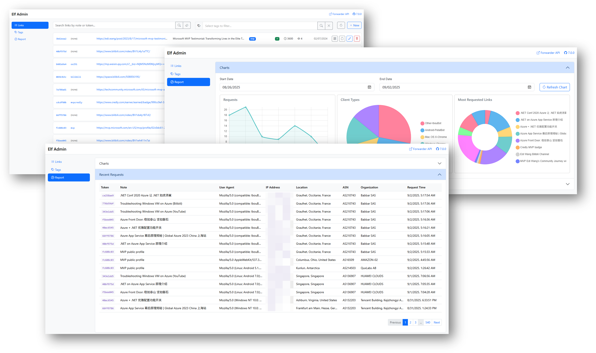

# Elf

[](https://github.com/EdiWang/Elf/actions/workflows/docker-api.yml) 
[](https://github.com/EdiWang/Elf/actions/workflows/docker-admin.yml)


The link forward service used by https://go.edi.wang. It generates static URLs for redirecting third party URLs. It's similar to, but **NOT a URL shorter**. 

- Use a static token to adapt changes to origin url.
- Track user click to generate report.

e.g.:

```
https://www.somewebsite.com/a-very-long-and-complicated-link-that-can-also-change?with=parameters
```

will be translate to `https://yourdomain/fw/token` or `https://yourdomain/aka/name`



## Forwarder Logic


## Deployment

### Automated Deployment on Azure (Recommended)

> You need to install [Azure CLI](https://learn.microsoft.com/en-us/cli/azure/install-azure-cli?view=azure-cli-latest&WT.mc_id=AZ-MVP-5002809) and login to Azure first.

The [deployment script](./deployment/main.bicep) will deploy both Forwarder API and Admin UI to Azure App Service using Linux + Docker. You need to provide a strong password for the SQL Server admin account.

First, clone this repo and `cd` to `deployment` directory. Run:

```powershell
# Login to Azure
az login

# Create a resource group
az group create --name elf-rg --location westus2

# Create resources with Bicep
az deployment group create --resource-group elf-rg --template-file main.bicep --parameters sqlAdminPassword=<Your Strong Password>
```

Visit the Forwarder API URL for the first time to initialize the database. Then visit the Admin UI URL to create your first forward link. 

You may need to add authentication for the Admin UI, see "Setup Authentication" section below.

### Manual Deployment by Docker

#### Setup Database

[Create an Azure SQL Database](https://docs.microsoft.com/en-us/azure/sql-database/sql-database-single-database-get-started?WT.mc_id=AZ-MVP-5002809) or a SQL Server 2019+ database on premises.

#### Forwarder API

```bash
docker run -d -p 80:8080 -e ConnectionStrings__ElfDatabase="<Your SQL Server Connection String>" --name elf-api ediwang/elf:latest
```

#### Manually Deploy Admin UI

```bash
docker run -d -p 80:8080 -e ConnectionStrings__ElfDatabase="<Your SQL Server Connection String>" --name elf-admin ediwang/elf-admin:latest
```

If you deploy both `elf-api` and `elf-admin` on the same server, make sure to use different ports. You may [work 996](https://996.icu/) to figure out the correct network setup yourself. I am rich, I choose Azure!

### Setup Authentication

Typically, `Elf.Api` should be publicly accessible, while `Elf.Admin` should be protected.

`Elf.Admin` does not have authentication out of box. It is up to you to setup authentication in front of them. You can use, but not limited to:

- Azure App Service Authentication
- Azure Container Apps Authentication
- Azure API Management

#### Example: Azure App Service Authentication

1. Create an [Azure App Service](https://docs.microsoft.com/en-us/azure/app-service/quickstart-dotnetcore?WT.mc_id=AZ-MVP-5002809)
2. Deploy `Elf.Admin` to the App Service
3. Enable [App Service Authentication](https://docs.microsoft.com/en-us/azure/app-service/overview-authentication-authorization?WT.mc_id=AZ-MVP-5002809)
4. Choose an identity provider, e.g. Microsoft
5. Configure the authentication settings to allow only authenticated users
6. Access the Elf Admin site, login with the identity provider

### Optional: Azure Cache for Redis

To use Redis, follow these steps:

1. Create an [Azure Cache for Redis instance](https://docs.microsoft.com/en-us/azure/azure-cache-for-redis/cache-overview?WT.mc_id=AZ-MVP-5002809)
2. Copy the connection string in "Access keys"
3. Set the connection string in `ConnectionStrings:RedisConnection` in `Elf.Api/appsettings.json` or environment variable
4. Restart the application
