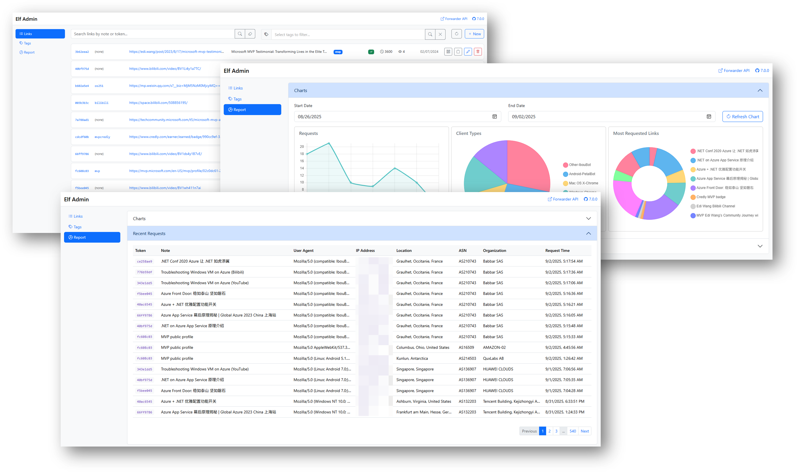
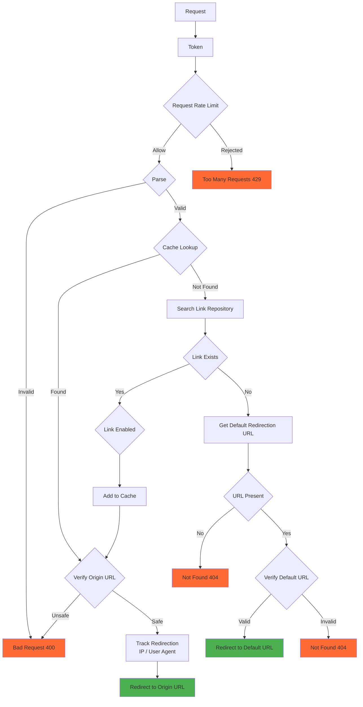

# Elf

[](https://github.com/EdiWang/Elf/actions/workflows/docker-api.yml) 
[](https://github.com/EdiWang/Elf/actions/workflows/docker-admin.yml)


The link forward service used by https://go.edi.wang. It generates static URLs for redirecting third party URLs. It's similar to, but **NOT a URL shorter**. 

- Use a static token to adapt changes to origin url.
- Track user click to generate report.

e.g.:

```
https://www.somewebsite.com/a-very-long-and-complicated-link-that-can-also-change?with=parameters
```

will be translate to `https://yourdomain/fw/token` or `https://yourdomain/aka/name`



## Development

Run the full test suite from the repository root:

```bash
dotnet test src/Elf.slnx
```

## Forwarder Logic


```mermaid
flowchart TD
    A[Request] --> B[Token]
    B --> C{Request Rate Limit}
    C -->|Allow| D{Parse}
    C -->|Rejected| E[Too Many Requests 429]
    D -->|Valid| F{Cache Lookup}
    D -->|Invalid| G[Bad Request 400]
    F -->|Found| H{Verify Origin URL}
    F -->|Not Found| I[Search Link Repository]
    I --> J{Link Exists}
    J -->|Yes| K{Link Enabled}
    J -->|No| L[Get Default Redirection URL]
    K --> M[Add to Cache]
    M --> H
    L --> N{URL Present}
    N -->|Yes| O{Verify Default URL}
    N -->|No| P[Not Found 404]
    H -->|Safe| Q[Track Redirection<br/>IP / User Agent]
    H -->|Unsafe| G
    Q --> R[Redirect to Origin URL]
    O -->|Valid| S[Redirect to Default URL]
    O -->|Invalid| T[Not Found 404]
    
    %% Style the terminal nodes
    E:::error
    G:::error
    P:::error
    T:::error
    R:::success
    S:::success
    
    classDef error fill:#ff6b35
    classDef success fill:#4CAF50
```
## Deployment

### Automated Deployment on Azure (Recommended)

> You need to install [Azure CLI](https://learn.microsoft.com/en-us/cli/azure/install-azure-cli?view=azure-cli-latest&WT.mc_id=AZ-MVP-5002809) and login to Azure first.

The [deployment script](./deployment/main.bicep) will deploy both Forwarder API and Admin UI to Azure App Service using Linux + Docker and Azure SQL Database. You need to provide a strong password for the SQL Server admin account.

First, clone this repo and `cd` to `deployment` directory. Or you can just download the [deployment script](./deployment/main.bicep) to your machine. And run:

```powershell
# Login to Azure
az login

# Create a resource group
az group create --name elf-rg --location westus2

# Create resources with Bicep
az deployment group create `
  --resource-group elf-rg `
  --template-file main.bicep `
  --parameters sqlAdminPassword=<Your Strong SQL Password> `
               adminLocalBootstrapPassword=<Your Strong Admin Password>
```

Visit the Forwarder API URL for the first time to initialize the database. Then visit the Admin UI URL to create your first forward link. 

The Bicep template configures Admin to use built-in local account authentication by default. Sign in with `adminLocalBootstrapUsername` and `adminLocalBootstrapPassword`, then complete the TOTP setup flow.

### Manual Deployment by Docker

#### Setup Database

Elf supports SQL Server and PostgreSQL.

For SQL Server, [create an Azure SQL Database](https://docs.microsoft.com/en-us/azure/sql-database/sql-database-single-database-get-started?WT.mc_id=AZ-MVP-5002809) or a SQL Server 2019+ database on premises.

For PostgreSQL, create an empty PostgreSQL database. For example:

```bash
docker run -d \
  --name elf-postgres \
  -e POSTGRES_USER=elf \
  -e POSTGRES_PASSWORD="<Your PostgreSQL Password>" \
  -e POSTGRES_DB=elf \
  -p 5432:5432 \
  postgres:latest
```

`Database__Provider` controls the database provider:

- `SqlServer` (default)
- `PostgreSql`

Visit the Forwarder API URL for the first time to initialize an empty database schema before using Admin UI.

#### Forwarder API

SQL Server:

```bash
docker run -d -p 80:8080 -e ConnectionStrings__ElfDatabase="<Your SQL Server Connection String>" --name elf-api ediwang/elf:latest
```

PostgreSQL:

```bash
docker run -d -p 80:8080 \
  -e Database__Provider="PostgreSql" \
  -e ConnectionStrings__ElfDatabase="Host=<Your PostgreSQL Host>;Port=5432;Database=elf;Username=elf;Password=<Your PostgreSQL Password>" \
  --name elf-api ediwang/elf:latest
```

#### Manually Deploy Admin UI

Admin uses built-in local account authentication by default. The first local account is initialized from `Authentication__Local__BootstrapUsername` and `Authentication__Local__BootstrapPassword` when no `LocalAccount` exists in `ElfConfiguration`.

SQL Server:

```bash
docker run -d -p 80:8080 \
  -e ConnectionStrings__ElfDatabase="<Your SQL Server Connection String>" \
  -e Authentication__Provider="Local" \
  -e Authentication__Local__BootstrapUsername="admin" \
  -e Authentication__Local__BootstrapPassword="<Your Strong Admin Password>" \
  -e Authentication__Totp__Issuer="Elf" \
  --name elf-admin ediwang/elf-admin:latest
```

PostgreSQL:

```bash
docker run -d -p 80:8080 \
  -e Database__Provider="PostgreSql" \
  -e ConnectionStrings__ElfDatabase="Host=<Your PostgreSQL Host>;Port=5432;Database=elf;Username=elf;Password=<Your PostgreSQL Password>" \
  -e Authentication__Provider="Local" \
  -e Authentication__Local__BootstrapUsername="admin" \
  -e Authentication__Local__BootstrapPassword="<Your Strong Admin Password>" \
  -e Authentication__Totp__Issuer="Elf" \
  --name elf-admin ediwang/elf-admin:latest
```

If you deploy both `elf-api` and `elf-admin` on the same server, make sure to use different ports. You may [work 996](https://996.icu/) to figure out the correct network setup yourself. I am rich, I choose Azure!

### Setup Authentication

Typically, `Elf.Api` should be publicly accessible, while `Elf.Admin` should be protected.

`Elf.Admin` supports three authentication providers through `Authentication__Provider`:

- `Local`: built-in single administrator account with password + TOTP. This is the default.
- `EntraID`: built-in OpenID Connect login with Microsoft Entra ID. This does not require Azure App Service Authentication.
- `External`: disables in-app Admin authorization so a reverse proxy or hosting layer can protect Admin.

#### Local Account

Local account settings:

```bash
Authentication__Provider=Local
Authentication__Local__BootstrapUsername=admin
Authentication__Local__BootstrapPassword=<Your Strong Admin Password>
Authentication__Totp__Issuer=Elf
```

The bootstrap password is used only when the `LocalAccount` record does not exist in `ElfConfiguration`. After the first successful sign-in and TOTP setup, the account is maintained from the Admin Account page. You can clear `Authentication__Local__BootstrapPassword` from the runtime environment after initialization.

#### Microsoft Entra ID

Create an app registration for Admin and add a Web redirect URI:

```text
https://<your-admin-host>/signin-oidc
```

Configure Admin with:

```bash
Authentication__Provider=EntraID
Authentication__EntraID__Instance=https://login.microsoftonline.com/
Authentication__EntraID__TenantId=<Tenant ID>
Authentication__EntraID__ClientId=<Application client ID>
Authentication__EntraID__ClientSecret=<Client secret>
Authentication__EntraID__CallbackPath=/signin-oidc
```

Optionally restrict access to specific users. Values are matched against the name, email, UPN, or `preferred_username` claims:

```bash
Authentication__EntraID__AllowedUsers__0=admin1@example.com
Authentication__EntraID__AllowedUsers__1=admin2@example.com
```

For Azure Bicep deployment, set:

```powershell
az deployment group create `
  --resource-group elf-rg `
  --template-file main.bicep `
  --parameters sqlAdminPassword=<Your Strong SQL Password> `
               adminAuthenticationProvider=EntraID `
               adminEntraTenantId=<Tenant ID> `
               adminEntraClientId=<Application client ID> `
               adminEntraClientSecret=<Client secret> `
               adminEntraAllowedUsers='["admin@example.com"]'
```

The Bicep template maps the first five `adminEntraAllowedUsers` entries to app settings. Add more users directly in App Service configuration with `Authentication__EntraID__AllowedUsers__5`, `Authentication__EntraID__AllowedUsers__6`, and so on if needed.

#### External Proxy Mode

Use `External` only when another layer already enforces Admin authentication, for example a reverse proxy, Cloudflare Access, Azure App Service Authentication, Azure Container Apps Authentication, or Azure API Management:

```bash
Authentication__Provider=External
```

In this mode, Elf does not challenge users or apply in-app authorization to Admin pages and API controllers. The external layer must deny anonymous traffic before it reaches `Elf.Admin`.

#### TOTP Recovery

If you still have a valid Admin session, use the Account page to reset the authenticator. This signs out the current session and forces TOTP setup on the next password login.

If all authenticator access is lost, stop Admin, configure a temporary strong `Authentication__Local__BootstrapPassword`, and remove the `LocalAccount` row from `ElfConfiguration`. Restart Admin and sign in with the bootstrap account to create a new password hash and TOTP secret. Back up the database first; this resets only the local Admin account record.

### Optional: Azure Cache for Redis

To use Redis, follow these steps:

1. Create an [Azure Cache for Redis instance](https://docs.microsoft.com/en-us/azure/azure-cache-for-redis/cache-overview?WT.mc_id=AZ-MVP-5002809)
2. Copy the connection string in "Access keys"
3. Set the connection string in `ConnectionStrings:RedisConnection` in `Elf.Api/appsettings.json` or environment variable
4. Restart the application
