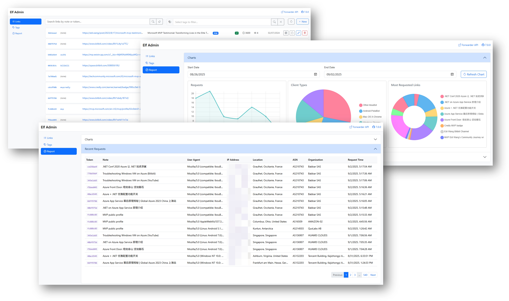
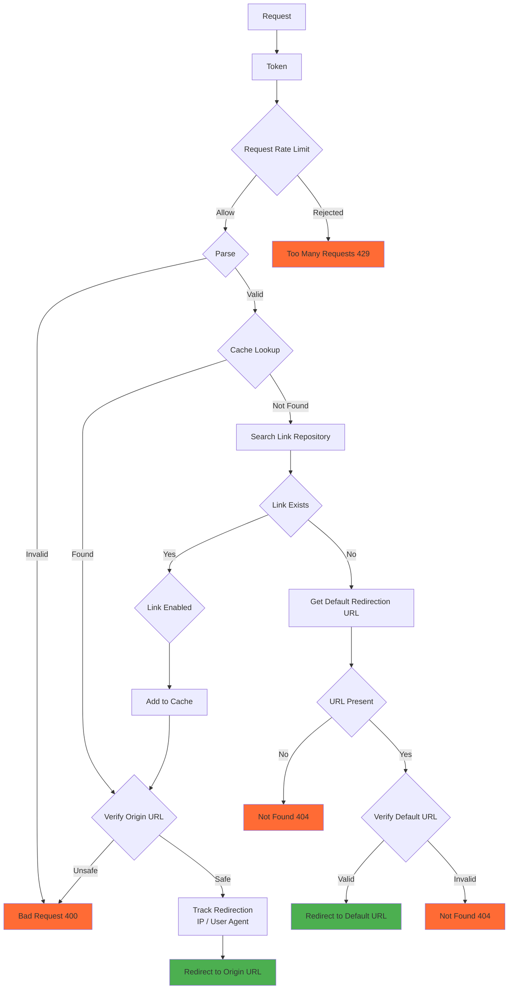

# Elf

[](https://github.com/EdiWang/Elf/actions/workflows/docker-elf.yml)


The link forward service used by https://go.edi.wang. It generates static URLs for redirecting third party URLs. It's similar to, but **NOT a URL shorter**. 

- Use a static token to adapt changes to origin url.
- Track user click to generate report.

e.g.:

```
https://www.somewebsite.com/a-very-long-and-complicated-link-that-can-also-change?with=parameters
```

will be translate to `https://yourdomain/fw/token` or `https://yourdomain/aka/name`



## Development

Run the full test suite from the repository root:

```bash
dotnet test src/Elf.slnx
```

## Forwarder Logic


```mermaid
flowchart TD
    A[Request] --> B[Token]
    B --> C{Request Rate Limit}
    C -->|Allow| D{Parse}
    C -->|Rejected| E[Too Many Requests 429]
    D -->|Valid| F{Cache Lookup}
    D -->|Invalid| G[Bad Request 400]
    F -->|Found| H{Verify Origin URL}
    F -->|Not Found| I[Search Link Repository]
    I --> J{Link Exists}
    J -->|Yes| K{Link Enabled}
    J -->|No| L[Get Default Redirection URL]
    K --> M[Add to Cache]
    M --> H
    L --> N{URL Present}
    N -->|Yes| O{Verify Default URL}
    N -->|No| P[Not Found 404]
    H -->|Safe| Q[Track Redirection<br/>IP / User Agent]
    H -->|Unsafe| G
    Q --> R[Redirect to Origin URL]
    O -->|Valid| S[Redirect to Default URL]
    O -->|Invalid| T[Not Found 404]
    
    %% Style the terminal nodes
    E:::error
    G:::error
    P:::error
    T:::error
    R:::success
    S:::success
    
    classDef error fill:#ff6b35
    classDef success fill:#4CAF50
```
## Deployment

### Local Deployment with Docker Compose (Recommended)

This starts PostgreSQL and one Elf application image. The same application serves public `/fw/*` and `/aka/*` redirects and the Admin UI under `/admin`.

Prerequisites:

- [Docker](https://www.docker.com/) with Docker Compose v2
- Local ports `5432` and `8080` available

Create the local environment file and replace both placeholder passwords with strong values:

```powershell
Copy-Item .env.example .env
```

Set `ELF_POSTGRES_PASSWORD` to a strong value containing only letters, digits, `_`, or `-`; Compose embeds it in the PostgreSQL connection string. Keep production passwords and OIDC client secrets in the deployment secret store.

The Compose file uses `postgres:18-alpine` and `ediwang/elf:latest`. It configures PostgreSQL and the merged application with the `PostgreSql` provider and built-in `Local` Admin authentication. The application port is published only on `127.0.0.1`; a reverse proxy on the same host can reach it, while remote clients cannot bypass that proxy.

Pull the Docker Hub images and start all services:

```powershell
docker compose pull
docker compose up -d
docker compose ps
```

Elf initializes an empty database schema during startup. Open the application at:

- Health: <http://localhost:8080/health>
- Admin UI: <http://localhost:8080/admin>
- Public redirects: <http://localhost:8080/fw/{token}> and <http://localhost:8080/aka/{akaName}>

Sign in to Admin with `ELF_ADMIN_USERNAME` and `ELF_ADMIN_PASSWORD` from `.env`, then complete the required TOTP setup. `ELF_FORWARDER_BASE_URL` controls the public base URL used by Admin when it generates forward links.

PostgreSQL data is stored in the named Docker volume `elf-postgres-data`. Stop the services while keeping the data with:

```powershell
docker compose down
```

The CI workflow tests the solution, then publishes the merged image as `ediwang/elf:latest` and `ediwang/elf:<commit-sha>`; it does not deploy or change production traffic. To pin a tested build, set `ELF_IMAGE` in `.env` to its commit tag or registry digest before `docker compose pull`.

To restore the prior two-container local deployment without deleting its PostgreSQL volume, stop the merged app and use the digest-pinned rollback file:

```powershell
docker compose stop elf
docker compose -f compose.rollback.yaml up -d --remove-orphans
```

For production rollback, set `ELF_API_PORT=8002`, `ELF_ADMIN_PORT=8003`, and `ELF_FORWARDER_BASE_URL=https://go.edi.wang`, then restore the saved Caddy configuration and remaining environment values. The example defaults `ELF_API_PORT` and `ELF_ADMIN_PORT` to the prior local ports `8080` and `8081`. Never run `docker compose down -v` during rollback.

To remove the database volume and start over, run the following only when you intentionally want to delete the local database:

```powershell
docker compose down -v
```

### Setup Authentication

The `/fw/*` and `/aka/*` routes are public. Protect `/admin` and every path under it.

`Elf.Admin` supports three authentication providers through `Authentication__Provider`:

- `Local`: built-in single administrator account with password + TOTP. This is the default.
- `OpenIdConnect`: standards-based OpenID Connect login using authorization code flow with PKCE.
- `External`: disables in-app Admin authorization so a reverse proxy or hosting layer can protect Admin.

#### Local Account

Local account settings:

```bash
Authentication__Provider=Local
Authentication__Local__BootstrapUsername=admin
Authentication__Local__BootstrapPassword=<Your Strong Admin Password>
Authentication__Totp__Issuer=Elf
```

The bootstrap password is used only when the `LocalAccount` record does not exist in `ElfConfiguration`. After the first successful sign-in and TOTP setup, the account is maintained from the Admin Account page. You can clear `Authentication__Local__BootstrapPassword` from the runtime environment after initialization.

#### OpenID Connect

Configure Elf as a confidential web client in an OIDC provider that publishes discovery metadata over HTTPS. Register both callback URLs:

```text
https://<your-admin-host>/admin/signin-oidc
https://<your-admin-host>/admin/signout-callback-oidc
```

Configure Admin with:

```bash
Authentication__Provider=OpenIdConnect
Authentication__OpenIdConnect__Authority=https://identity.example.com/
Authentication__OpenIdConnect__ClientId=<Client ID>
Authentication__OpenIdConnect__ClientSecret=<Client secret>
Authentication__OpenIdConnect__CallbackPath=/signin-oidc
Authentication__OpenIdConnect__SignedOutCallbackPath=/signout-callback-oidc
Authentication__OpenIdConnect__NameClaimType=name
Authentication__OpenIdConnect__Scopes__0=openid
Authentication__OpenIdConnect__Scopes__1=profile
Authentication__OpenIdConnect__Scopes__2=email
```

These callback path settings are relative to the app. The Admin app's `/admin` path base makes their public callback URLs `/admin/signin-oidc` and `/admin/signout-callback-oidc`.

Store the client secret in the deployment secret-management system, not in `appsettings.json` or source control.

#### Reverse Proxy and Forwarded Headers

When TLS is terminated by a reverse proxy, Kestrel receives the request as HTTP unless the proxy's forwarded headers are processed. The single `Elf.Admin` web host enables `UseSmartXFFHeader()` when `ForwardedHeaders:Enabled` is `true`; forwarded headers are accepted only from trusted proxy addresses.

Configure each proxy hop using the address as seen by the application or container, not necessarily the proxy's public address:

```bash
ForwardedHeaders__Enabled=true
ForwardedHeaders__KnownProxies__0=203.0.113.10
```

Do not trust arbitrary client-supplied `X-Forwarded-*` headers. If the terminating proxy is not trusted, an OIDC challenge can generate an `http://.../admin/signin-oidc` callback even when the browser uses HTTPS. The identity provider then rejects the request with a redirect URI mismatch (`AADSTS50011`). Verify the generated `redirect_uri` before changing the identity-provider registration.


OIDC authentication does not automatically grant Admin access. Add each administrator's exact, stable `sub` claim to the allowlist:

```bash
Authentication__OpenIdConnect__AllowedSubjects__0=<administrator subject>
Authentication__OpenIdConnect__AllowedSubjects__1=<another administrator subject>
```

An empty allowlist denies Admin access to every OIDC identity. To bootstrap the first administrator, sign in through `/admin/auth/signin`, open `/admin/auth/identity` in the same browser session, copy the returned `subject` value into `AllowedSubjects`, restart Elf.Admin, and sign in again. Do not authorize by email, name, or preferred username because those values can change.

Microsoft Entra ID remains supported as a standard OIDC provider. Use a tenant-specific v2 authority:

```text
https://login.microsoftonline.com/<tenant-id>/v2.0
```

For Azure Bicep deployment with Entra ID, set:

```powershell
az deployment group create `
  --resource-group elf-rg `
  --template-file main.bicep `
  --parameters sqlAdminPassword=<Your Strong SQL Password> `
               adminAuthenticationProvider=OpenIdConnect `
               adminOidcAuthority=https://login.microsoftonline.com/<tenant-id>/v2.0 `
               adminOidcClientId=<Application client ID> `
               adminOidcClientSecret=<Client secret> `
               adminOidcAllowedSubjects='["<administrator subject>"]'
```

The OIDC settings are validated at startup. The authority must be an absolute HTTPS URL without a query or fragment, callback paths must be application-relative, and scopes must include `openid`. Access and refresh tokens are not persisted in the application cookie.

Existing Entra-specific deployments must replace `Authentication__Provider=EntraID` and all `Authentication__EntraID__*` keys. Build the new `Authority` as `https://login.microsoftonline.com/<tenant-id>/v2.0`. Email-based `AllowedUsers` values cannot be migrated safely; bootstrap each administrator's OIDC `sub` through `/admin/auth/identity` and configure it under `AllowedSubjects`.

#### External Proxy Mode

Use `External` only when another layer already enforces Admin authentication, for example a reverse proxy, Cloudflare Access, Azure App Service Authentication, Azure Container Apps Authentication, or Azure API Management:

```bash
Authentication__Provider=External
```

In this mode, Elf does not challenge users or apply in-app authorization to Admin pages and API controllers. The external layer must deny anonymous traffic before it reaches `Elf.Admin`.

For Caddy, match both the exact `/admin` path and its descendants. This example uses Basic Auth over Caddy-managed HTTPS; store the password hash and username in the Caddy service environment. Keep the application port bound to loopback as the Compose file does, and preserve the `/admin` prefix when proxying:

```caddyfile
go.edi.wang {
	@admin path /admin /admin/*
	handle @admin {
		basic_auth {
			{$ELF_PROXY_ADMIN_USERNAME} {$ELF_PROXY_ADMIN_PASSWORD_HASH}
		}
		reverse_proxy 127.0.0.1:8080
	}
	handle {
		reverse_proxy 127.0.0.1:8080
	}
}
```

Generate the password hash with `caddy hash-password`, keep it in the proxy's secret store, and use `Authentication__Provider=External` only after both `/admin` and `/admin/*` require authentication. Do not publish the container port on a public interface. For OpenID Connect, register `https://go.edi.wang/admin/signin-oidc` and `https://go.edi.wang/admin/signout-callback-oidc` with the identity provider.

#### TOTP Recovery

If you still have a valid Admin session, use the Account page to reset the authenticator. This signs out the current session and forces TOTP setup on the next password login.

If all authenticator access is lost, stop Admin, configure a temporary strong `Authentication__Local__BootstrapPassword`, and remove the `LocalAccount` row from `ElfConfiguration`. Restart Admin and sign in with the bootstrap account to create a new password hash and TOTP secret. Back up the database first; this resets only the local Admin account record.

### Optional: Redis Distributed Cache

Elf supports any Redis-compatible service that can be reached with a standard Redis connection string. Redis is optional, but it is recommended when the Forwarder API runs on multiple instances or when cached links must be invalidated by the Admin application.

To use Redis:

1. Create or select a Redis-compatible service.
2. Set `ELF_REDIS_CONNECTION` in `.env` to its connection string.
3. Restart each Elf application instance.

If the connection string is omitted, the application uses an in-memory cache. This is suitable for a single instance. Multiple Elf instances must share Redis so an Admin change invalidates cached links across instances.

Only links with a positive TTL are cached. A TTL of `0` disables caching for that link.
