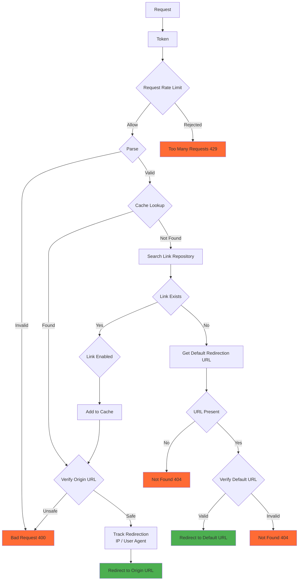

# Elf

[](https://github.com/EdiWang/Elf/actions/workflows/docker-api.yml) 
[](https://github.com/EdiWang/Elf/actions/workflows/docker-admin.yml)


The link forward service used by https://go.edi.wang. It generates static URLs for redirecting third party URLs. It's similar to, but **NOT a URL shorter**. 

- Use a static token to adapt changes to origin url.
- Track user click to generate report.

e.g.:

```
https://www.somewebsite.com/a-very-long-and-complicated-link-that-can-also-change?with=parameters
```

will be translate to `https://yourdomain/fw/token` or `https://yourdomain/aka/name`


## Development

Run the full test suite from the repository root:

```bash
dotnet test src/Elf.slnx
```

## Forwarder Logic


```mermaid
flowchart TD
    A[Request] --> B[Token]
    B --> C{Request Rate Limit}
    C -->|Allow| D{Parse}
    C -->|Rejected| E[Too Many Requests 429]
    D -->|Valid| F{Cache Lookup}
    D -->|Invalid| G[Bad Request 400]
    F -->|Found| H{Verify Origin URL}
    F -->|Not Found| I[Search Link Repository]
    I --> J{Link Exists}
    J -->|Yes| K{Link Enabled}
    J -->|No| L[Get Default Redirection URL]
    K --> M[Add to Cache]
    M --> H
    L --> N{URL Present}
    N -->|Yes| O{Verify Default URL}
    N -->|No| P[Not Found 404]
    H -->|Safe| Q[Track Redirection<br/>IP / User Agent]
    H -->|Unsafe| G
    Q --> R[Redirect to Origin URL]
    O -->|Valid| S[Redirect to Default URL]
    O -->|Invalid| T[Not Found 404]
    
    %% Style the terminal nodes
    E:::error
    G:::error
    P:::error
    T:::error
    R:::success
    S:::success
    
    classDef error fill:#ff6b35
    classDef success fill:#4CAF50
```
## Deployment

### Automated Deployment on Azure (Recommended)

> You need to install [Azure CLI](https://learn.microsoft.com/en-us/cli/azure/install-azure-cli?view=azure-cli-latest&WT.mc_id=AZ-MVP-5002809) and login to Azure first.

The [deployment script](./deployment/main.bicep) will deploy both Forwarder API and Admin UI to Azure App Service using Linux + Docker and Azure SQL Database. You need to provide a strong password for the SQL Server admin account.

First, clone this repo and `cd` to `deployment` directory. Or you can just download the [deployment script](./deployment/main.bicep) to your machine. And run:

```powershell
# Login to Azure
az login

# Create a resource group
az group create --name elf-rg --location westus2

# Create resources with Bicep
az deployment group create `
  --resource-group elf-rg `
  --template-file main.bicep `
  --parameters sqlAdminPassword=<Your Strong SQL Password> `
               adminLocalBootstrapPassword=<Your Strong Admin Password>
```

Visit the Forwarder API URL for the first time to initialize the database. Then visit the Admin UI URL to create your first forward link. 

The Bicep template configures Admin to use built-in local account authentication by default. Sign in with `adminLocalBootstrapUsername` and `adminLocalBootstrapPassword`, then complete the TOTP setup flow.

### Local Deployment with Docker Compose

This starts PostgreSQL, the Forwarder API, and the Admin UI with images pulled from Docker Hub. The application images are not built locally.

Prerequisites:

- [Docker](https://www.docker.com/) with Docker Compose v2
- Local ports `5432`, `8080`, and `8081` available

Create the local environment file and replace both placeholder passwords with strong values:

```powershell
Copy-Item .env.example .env
```

The Compose file uses `postgres:18-alpine`, `ediwang/elf:latest`, and `ediwang/elf-admin:latest`. It configures PostgreSQL, selects the `PostgreSql` provider, and enables the built-in `Local` Admin account authentication.

Pull the Docker Hub images and start all services:

```powershell
docker compose pull
docker compose up -d
docker compose ps
```

The API initializes the empty database schema before the Admin UI starts. Open the services at:

- Forwarder API: <http://localhost:8080>
- Admin UI: <http://localhost:8081>

Sign in to Admin with `ELF_ADMIN_USERNAME` and `ELF_ADMIN_PASSWORD` from `.env`, then complete the required TOTP setup. `ELF_FORWARDER_BASE_URL` controls the public base URL used by Admin when it generates forward links.

PostgreSQL data is stored in the named Docker volume `elf-postgres-data`. Stop the services while keeping the data with:

```powershell
docker compose down
```

To remove the database volume and start over, run the following only when you intentionally want to delete the local database:

```powershell
docker compose down -v
```

### Setup Authentication

Typically, `Elf.Api` should be publicly accessible, while `Elf.Admin` should be protected.

`Elf.Admin` supports three authentication providers through `Authentication__Provider`:

- `Local`: built-in single administrator account with password + TOTP. This is the default.
- `OpenIdConnect`: standards-based OpenID Connect login using authorization code flow with PKCE.
- `External`: disables in-app Admin authorization so a reverse proxy or hosting layer can protect Admin.

#### Local Account

Local account settings:

```bash
Authentication__Provider=Local
Authentication__Local__BootstrapUsername=admin
Authentication__Local__BootstrapPassword=<Your Strong Admin Password>
Authentication__Totp__Issuer=Elf
```

The bootstrap password is used only when the `LocalAccount` record does not exist in `ElfConfiguration`. After the first successful sign-in and TOTP setup, the account is maintained from the Admin Account page. You can clear `Authentication__Local__BootstrapPassword` from the runtime environment after initialization.

#### OpenID Connect

Configure Elf as a confidential web client in an OIDC provider that publishes discovery metadata over HTTPS. Register both callback URLs:

```text
https://<your-admin-host>/signin-oidc
https://<your-admin-host>/signout-callback-oidc
```

Configure Admin with:

```bash
Authentication__Provider=OpenIdConnect
Authentication__OpenIdConnect__Authority=https://identity.example.com/
Authentication__OpenIdConnect__ClientId=<Client ID>
Authentication__OpenIdConnect__ClientSecret=<Client secret>
Authentication__OpenIdConnect__CallbackPath=/signin-oidc
Authentication__OpenIdConnect__SignedOutCallbackPath=/signout-callback-oidc
Authentication__OpenIdConnect__NameClaimType=name
Authentication__OpenIdConnect__Scopes__0=openid
Authentication__OpenIdConnect__Scopes__1=profile
Authentication__OpenIdConnect__Scopes__2=email
```

Store the client secret in the deployment secret-management system, not in `appsettings.json` or source control.

OIDC authentication does not automatically grant Admin access. Add each administrator's exact, stable `sub` claim to the allowlist:

```bash
Authentication__OpenIdConnect__AllowedSubjects__0=<administrator subject>
Authentication__OpenIdConnect__AllowedSubjects__1=<another administrator subject>
```

An empty allowlist denies Admin access to every OIDC identity. To bootstrap the first administrator, sign in through `/auth/signin`, open `/auth/identity` in the same browser session, copy the returned `subject` value into `AllowedSubjects`, restart Elf.Admin, and sign in again. Do not authorize by email, name, or preferred username because those values can change.

Microsoft Entra ID remains supported as a standard OIDC provider. Use a tenant-specific v2 authority:

```text
https://login.microsoftonline.com/<tenant-id>/v2.0
```

For Azure Bicep deployment with Entra ID, set:

```powershell
az deployment group create `
  --resource-group elf-rg `
  --template-file main.bicep `
  --parameters sqlAdminPassword=<Your Strong SQL Password> `
               adminAuthenticationProvider=OpenIdConnect `
               adminOidcAuthority=https://login.microsoftonline.com/<tenant-id>/v2.0 `
               adminOidcClientId=<Application client ID> `
               adminOidcClientSecret=<Client secret> `
               adminOidcAllowedSubjects='["<administrator subject>"]'
```

The OIDC settings are validated at startup. The authority must be an absolute HTTPS URL without a query or fragment, callback paths must be application-relative, and scopes must include `openid`. Access and refresh tokens are not persisted in the application cookie.

Existing Entra-specific deployments must replace `Authentication__Provider=EntraID` and all `Authentication__EntraID__*` keys. Build the new `Authority` as `https://login.microsoftonline.com/<tenant-id>/v2.0`. Email-based `AllowedUsers` values cannot be migrated safely; bootstrap each administrator's OIDC `sub` through `/auth/identity` and configure it under `AllowedSubjects`.

#### External Proxy Mode

Use `External` only when another layer already enforces Admin authentication, for example a reverse proxy, Cloudflare Access, Azure App Service Authentication, Azure Container Apps Authentication, or Azure API Management:

```bash
Authentication__Provider=External
```

In this mode, Elf does not challenge users or apply in-app authorization to Admin pages and API controllers. The external layer must deny anonymous traffic before it reaches `Elf.Admin`.

#### TOTP Recovery

If you still have a valid Admin session, use the Account page to reset the authenticator. This signs out the current session and forces TOTP setup on the next password login.

If all authenticator access is lost, stop Admin, configure a temporary strong `Authentication__Local__BootstrapPassword`, and remove the `LocalAccount` row from `ElfConfiguration`. Restart Admin and sign in with the bootstrap account to create a new password hash and TOTP secret. Back up the database first; this resets only the local Admin account record.

### Optional: Azure Cache for Redis

To use Redis, follow these steps:

1. Create an [Azure Cache for Redis instance](https://docs.microsoft.com/en-us/azure/azure-cache-for-redis/cache-overview?WT.mc_id=AZ-MVP-5002809)
2. Copy the connection string in "Access keys"
3. Set the connection string in `ConnectionStrings:RedisConnection` in `Elf.Api/appsettings.json` or environment variable
4. Restart the application
